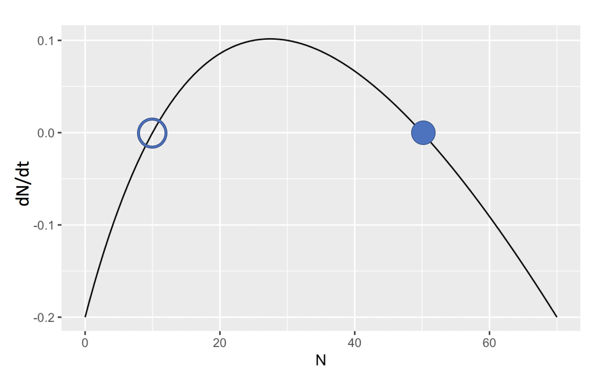

# Number 1
Let $t$ equal the number of days and . Then we have 
\[ cells = 2^{t/109}\]
Set the lefthand side to $10^{12}$ to find the $t$ we are interested in
\[10^{12} = 2^{t/109} \]
Solve for $t$
\[log_2 10^{12} = log_2  2^{t/109} \]
\[log_2 10^{12} = t/109 \]
\[t = 109*log_2 10^{12}\]
\[t \approx 4345.082\]


# Number 2

###Find equilibrium points
\[\frac{\delta N}{\delta T} = b \frac{N}{N+M} - d\]
Set the rate of change(left ahnd side) to 0 to find the equilibrium points, $\bar{N}$

\[0 = b \frac{\bar{N}}{\bar{N}+M} - d\]

\[d = b \frac{\bar{N}}{\bar{N}+M}\]

\[\frac{d}{b} = \frac{\bar{N}}{\bar{N}+M}\]

\[\frac{d(\bar{N}+M)}{b} = \bar{N}\]

\[\frac{d\bar{N}}{b} + \frac{dM}{b}= \bar{N}\]

\[\frac{dM}{b}= \bar{N}- \frac{d\bar{N}}{b} \]

\[\frac{dM}{b}= \bar{N}(1 - \frac{d}{b}) \]

\[ \bar{N} = \frac{dM}{b(1 - \frac{d}{b})} \]

\[ \bar{N} = \frac{dM}{b - d} \]

So we have found that there is only a singlular equilibrium point,  $\bar{N} = \frac{dM}{b - d}$

Now we will test for its stability

###Test for stability

Take the derivative of dN/dt with respect to N

\[F = \frac{\delta N}{\delta T} = b \frac{N}{N+M} - d \]

\[\frac{\delta F}{\delta N} = \frac{\delta }{\delta N} [b \frac{N}{N+M} - d ]\]

\[\frac{\delta F}{\delta N} =   \frac{\delta }{\delta N} b\frac{N}{N+M} - \frac{\delta }{\delta N} d \]

\[\frac{\delta F}{\delta N} =   b\frac{\delta }{\delta N} \frac{N}{N+M} - 0 \]

Use the quotient rule

\[\frac{\delta F}{\delta N} =   b \frac{(N+M)1 - N(1+0)}{(N+M)^2}   \]

\[\frac{\delta F}{\delta N} =   b \frac{N+M - N}{(N+M)^2}   \]

\[\frac{\delta F}{\delta N} =   b \frac{M}{(N+M)^2}   \]

Now we evaluate this derivataive at the equilibrium points to see if they are stable


\[\frac{\delta F}{\delta N} |_{\bar{N} = \frac{dM}{b - d} } =   b \frac{M}{((\frac{dM}{b - d})+M)^2}   \]

\[\frac{\delta F}{\delta N} |_{\bar{N} = \frac{dM}{b - d} } =   b \frac{M}{((\frac{dM}{b - d})+\frac{(b-d)M}{b - d})^2}   \]

\[\frac{\delta F}{\delta N} |_{\bar{N} = \frac{dM}{b - d} } =   b \frac{M}{(\frac{dM}{b - d}+\frac{bM-dM}{b - d})^2}   \]

\[\frac{\delta F}{\delta N} |_{\bar{N} = \frac{dM}{b - d} } =   b \frac{M}{(\frac{dM+ bM-dM}{b - d})^2}   \]

\[\frac{\delta F}{\delta N} |_{\bar{N} = \frac{dM}{b - d} } =   b \frac{M}{(\frac{bM}{b - d})^2}   \]

\[\frac{\delta F}{\delta N} |_{\bar{N} = \frac{dM}{b - d} } =    \frac{bM}{(\frac{bM}{b - d})^2}   \]

\[\frac{\delta F}{\delta N} |_{\bar{N} = \frac{dM}{b - d} } =    \frac{bM}{(\frac{(bM)^2}{(b - d)^2})}   \]

\[\frac{\delta F}{\delta N} |_{\bar{N} = \frac{dM}{b - d} } =    \frac{1}{(\frac{bM}{(b - d)^2})}   \]

\[\frac{\delta F}{\delta N} |_{\bar{N} = \frac{dM}{b - d} } =    \frac{(b - d)^2}{bM}   \]

Since the numerator can only ever be 0 or greater than 0, then this equilibrium point is only unstable if the numerator is non-zero and the denominator is negative, i.e. when $b \neq d$ and either b or M is negative but not the other. But since b is birthrate and M is the number of males, then in a nature-modeling system, negative values for either would not be realistic. Thus this equilibrium point, $\bar{N} = \frac{dM}{b - d}$ is unstable under any realistic paramters

### Number 2 part 2
Which equilibrium point tells you the critical threshold for population extinction? 

I am interpreting this question to be asking me to show that below the single equilibrium point, the population tends toward zero. I will prove this by showing that for $0 < N=n < \bar{N} = \frac{dM}{b - d}$, the derivative, $\frac{\delta N}{\delta T}$ is negative

We showed at the beginning of this problem that for $N = \bar{N} = \frac{dM}{b - d}$, $\frac{\delta N}{\delta T} = b \frac{N}{N+M} - d = 0$, which implies that for $N = \bar{N} = \frac{dM}{b - d}$, we have  $b \frac{N}{N+M} = d$ therefore to show that for $0 < N=n < \bar{N} = \frac{dM}{b - d}$, the derivative, $\frac{\delta N}{\delta T} < 0$, we need only show that $b \frac{n}{n+M} < b \frac{\bar{N}}{\bar{N}+M}$. As long as b is positive, this is true if $\frac{n}{n+M} <  \frac{\bar{N}}{\bar{N}+M}$. Now note that the derivative of  $\frac{N}{N+M}$ wrt N is equal to $\frac{N}{(N+M)^2}$ (found using the quotient rule), which is always positive as long as N and M are positive. Therefore, $\frac{N}{N+M}$ is monotone increasing wrt N, and since $n < \bar{N}$ this implies that $\frac{n}{n+M} <  \frac{\bar{N}}{\bar{N}+M}$ which in turn implies that $\frac{\delta N}{\delta T}|_{N = n <  \bar{N}} < 0$. This implies that for $N <  \bar{N} = \frac{dM}{b - d}$, the population tends toward extinction. 


How does this relate to the Allee effect?

The Allee effect concerns positive density dependence, whereby a species future density is positively correleated with its current density. Given that below a certain threshold, the mosquitos tend toward extinction, but above it they survive, this can be considered positive density dependence and thus related to the Allee effect


# Number 3

First we modify the code to explore over a range of values of N, increasing the max time, t to make it clear where dN/dt ends up for each starting value of N
(Please ignore the warning messages. I have no idea how to supress them. I tried using warning=FALSE like we learned in comp bio but it doesnt work for these warnings for some reason)
```{r message=FALSE, warning=FALSE}
require(deSolve)
## Loading required package: deSolve
# Initial values
state <- c(N=20)
times <- seq(0,800,by=0.1)

# Parameters
parameters <- c(b = 2.4,c=0.02,M=50,d=0.2)

# Model
sterile_insect <- function(t,state,parameters){
  with(as.list(c(state,parameters)),{
    dN <- b*N/(N+M) - d - c*N
    list(c(dN))
  })}

# Solve model and plot results
out <- ode(y = state,times=times,func=sterile_insect,parms=parameters)
par(mfrow=c(1,1))
plot(out[,1],out[,2],ylab='N',xlab='time',las=1, ylim=c(-1, 100), pch=20, cex = .001 )

##Plot the population curve for multiple starting values of N on the same plot

states = seq(0, 60,by=1)

for (currState in states){
  state <- c(N=currState)
  times <- seq(0,800,by=0.1)

  # Parameters
  parameters <- c(b = 2.4,c=0.02,M=50,d=0.2)

  # Model
  sterile_insect <- function(t,state,parameters){
    with(as.list(c(state,parameters)),{
      dN <- b*N/(N+M) - d - c*N
      list(c(dN))
    })}

  # Solve model and plot results
  out <- ode(y = state,times=times,func=sterile_insect,parms=parameters)
  par(mfrow=c(1,1))
  points(out[,1],out[,2],ylab='N',xlab='time',las=1, pch=20, cex = .001)

}
```
From this plot it is clear that there are two equilibrium points with this paramter set, at N=10 and N=50, where N=10 is unstable, and N=50 is stable. 


To "sketch" dN/dt as asked for, first we plot dN/dt using ggplot2's stat_function

```{r}
library(ggplot2)

f <- ggplot(data.frame(N = c(0, 70)), aes(N))


b = 2.4
c=0.02
M=50
d=0.2


dN <- function(N) {b*N/(N+M) - d - c*N}
f + stat_function(fun = dN)
```

Now that we have created the plot, we can "sketch" on top of it to highlight the equilibrium points and their stability
 
 <p style="text-align:left;"></p>

